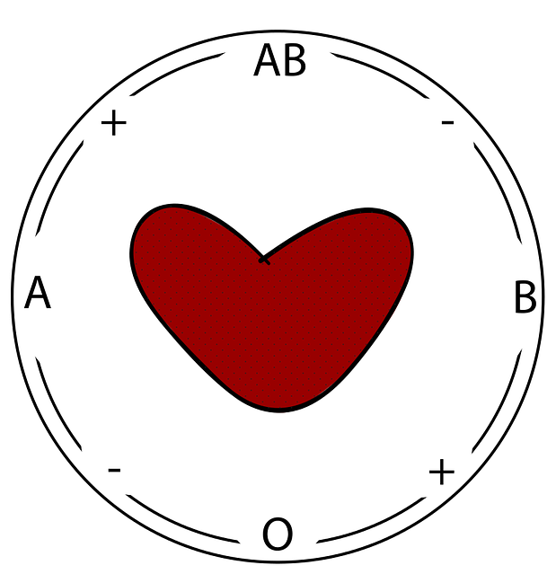
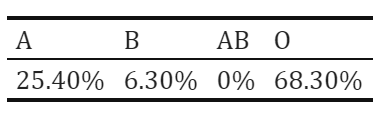

# Value of Evidence Example

```{r fig2, echo=FALSE,out.width="30%"}

```

Reconsider the following example from Case Study lecture 2:
A domestic burglary had been committed in New Zealand. It was thought that the perpetrator had cut themselves on a piece of glass, which was found at the crime scene. The blood was of type O (in the ABO system). 

We shall assume there is no explanation for the presence of the blood on the glass other than it got there when broken by the offender (that is, we assume a link between blood and offender).  

We consider the following hypotheses:

* $H_{p}$: The suspect is the source of the blood.
* $H_{d}$: Someone other than the suspect is the source of the blood. 


Here are the frequencies of blood groups on the ABO system in New Zealand at the time of the burglary:

```{r bgs, echo=FALSE,out.width="30%"}

```

<br>

**What is the value of evidence (V) in this example? (To 3 decimal places).**

`r hide("Hint 1")`

E is the evidence of blood of type O found on the piece of glass.
Remember that $V=\frac{P(E|H_{p})}{P(E|H_{d})}$.

`r unhide()`

`r hide("Hint 2")`

In this example, $P(E|H_{p})$ is the probability of finding blood of type O on the piece of glass if the suspect was the source of the blood.

Similarly, $P(E|H_{d})$ is the probability of finding blood of type O on the piece of glass if someone other than the suspect was the source.

`r unhide()`

`r fitb(1.464)`

`r hide("Solution")`

$P(E|Hp)=1$, as we know the suspect has blood group O. $P(E|Hd)=0.683$, as the prevalence of blood group O is 68.3%. Hence, $V=\frac{P(E|Hp)}{P(E|Hd)}=\frac{1}{0.683}=1.464$.

`r unhide()`

<br>

Remember the following relation:
\begin{align*}
  \text{Odds}(H_{p}|E)=V \times \text{Odds}(H_{p})
\end{align*}

Assume that, before considering the blood group as piece of evidence, the prior probability of the suspect being the source of the blood is $P(H_{p})=0.2$. 

<br>

**What are the prior odds in favour of Hp? (To 2 decimal places).**

`r hide("Hint 1")`

The prior odds in favour of $H_{p}$ can be computed as $\text{Odds}(H_{p})=\frac{P(H_{p})}{P(H_{d})}.

`r unhide()`

`r hide("Hint 2")`

Here, $H_{p}$ and $H_{d}$ are complementary hypotheses. Hence, $P(H_{d})=1-P(H_{p})$.

`r unhide()`

`r fitb(0.25)`

`r hide("Solution")`

$Odds(Hp)=\frac{P(Hp)}{(1-P(Hp))}= \frac{0.2}{0.8} = 0.25$.

`r unhide()`

<br>

**What are the posterior odds in favour of Hp, for the value of evidence and prior odds you have just computed? (To 3 decimal places).**

`r hide("Hint")`

The posterior odds can be computed as $Odds(Hp|E)= V \times Odds(Hp)$.

`r unhide()`

`r fitb(0.366)`

`r hide("Solution")`

$Odds(Hp|E)= V \times Odds(Hp) = 1.464 \times 0.25=0.366$

`r unhide()`

<br>

Remember the following relation:
\begin{align*}
  P(H_{p}|E)=\frac{\text{Odds}(H_{p}|E)}{\text{Odds}(H_{p}|E)+1}
\end{align*}
Now, plot the posterior probability of $H_{p}$, given the evidence, against the prior probability for each $P(H_{p})$ in {0.01,0.02,0.03,...,0.99}.  You can create an object which contains a sequence of values using the `seq()` function, e.g. `seq(from=0.01,to=0.99,by=0.01)`.  You can create a "quick" plot using `plot(x=...,y=...,type=...)`, where `x` and `y` are two vectors of the same length and `type` can take values like `"p"` for points and `"l"` for line (note that the letters must appear in quotes). 

If you want to create the plot using ggplot, you will have to add the two vectors to a dataframe first. Once you have created the objects `prior_prob` and `posterior_prob`, this can be done using the following code:

```{r compute_odds, eval = FALSE}
probs <- as.data.frame(cbind(prior_prob,posterior_prob))
ggplot(data=probs,aes(prior_prob,posterior_prob)) + geom_line()
```

`r hide("Hint 1")`

```{r hintone, eval = FALSE}
prior_prob <- seq(from=0.01,to=0.99,by=0.01)
prior_odds <- prior_prob/(1-prior_prob)
```

`r unhide()`

`r hide("Hint 2")`

```{r hinttwo, eval = FALSE}

prior_prob <- seq(from=0.01,to=0.99,by=0.01)
prior_odds <- prior_prob/(1-prior_prob)
V <- 1.464
posterior_odds <- V*prior_odds
posterior_prob <- posterior_odds/(posterior_odds+1)
```

`r unhide()`

`r hide("Solution")`

```{r plot_solution, eval = FALSE}

prior_prob <- seq(from=0.01,to=0.99,by=0.01)
prior_odds <- prior_prob/(1-prior_prob)
V <- 1.464
posterior_odds <- V*prior_odds
posterior_prob <- posterior_odds/(posterior_odds+1)
plot(x=prior_prob,y=posterior_prob,type='l')
```

`r unhide()`

<br>

Since we want to compare the posterior probability with the prior probability (both being between 0 and 1), it would be better for them to be on the same scale. Here is an option for how to get them to be on the same scale and adding a reference line to display the case where the prior and posterior probabilities are the same, in ggplot:

```{r warning=FALSE}
library(ggplot2)
prior_prob <- seq(from=0.01,to=0.99,by=0.01)
prior_odds <- prior_prob/(1-prior_prob)
V <- 1.464
posterior_odds <- V*prior_odds
posterior_prob <- posterior_odds/(posterior_odds+1)
prior_post_data <- as.data.frame(cbind(prior_prob,posterior_prob))

ggplot(prior_post_data, aes(x = prior_prob, y = posterior_prob)) + 
        geom_line() +      
        #defining scale_x_continuous and scale_y_continuous in          the same way causes the scales for prior and posterior          probabilities to be the same 
        scale_x_continuous(limits = c(0,1)) + 
        scale_y_continuous(limits = c(0,1)) + 
        geom_abline(intercept=0,slope=1,col="red",linetype="dashed") +
  xlab("Prior Probability") + ylab("Posterior Probability")
```

<br>

**What is the posterior probability of Hp, given the evidence, corresponding to a prior probability of $P(H_p) = 0.6$? (As a percentage, to 2 decimal places)**

`r hide("Hint 1")`

First, compute $\text{Odds}(H_{p}|E)=V \times \text{Odds}(H_{p})$.

`r unhide()`

`r hide("Hint 2")`

Then, you can compute $P(H_{p}|E)=\frac{\text{Odds}(H_{p}|E)}{\left(\text{Odds}(H_{p}|E)+1\right)}$.

`r unhide()`

`r fitb(68.71)`

`r hide("Solution")`

$Odds(Hp|E)=V \times Odds(Hp)=1.464 \times \frac{0.6}{0.4}=2.196$ 
<br>
$P(Hp|E)=\frac{Odds(Hp|E)}{(Odds(Hp|E)+1)}=\frac{2.196}{3.196}= 0.6871$

`r unhide()`

<br>
