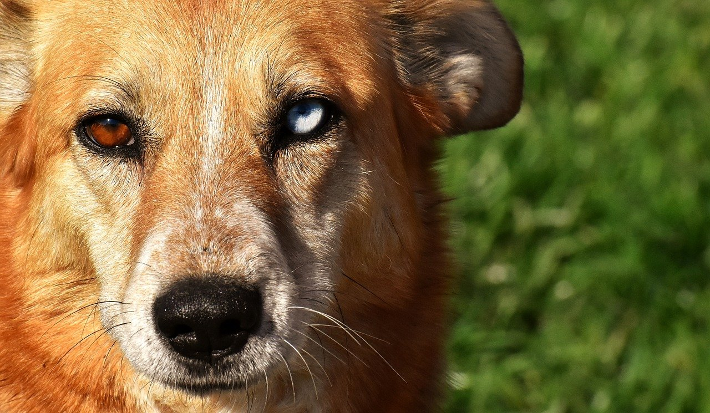

# Group Exercise

<br>

## Sample size needed to obtain certain probabilities for observing rare events

<br>

(This was briefly discussed in lecture 3)  

Assume we are interested in an event that is observed with probability $\lambda$. 

Remember that the probability of observing at least one such event in a sample of size $n$ is given by 

\begin{align*}
1-(1-\lambda)^{n}
\end{align*}

<br>

## Differently coloured eyes

<br>

```{r fig4, echo=FALSE,out.width="40%"}

```  
 
<br>

Having two different eye colours is known as heterochromia iridis. It is approximated that 6 in 1000 people have such a condition (i.e., $\lambda=6/1000$), although for most of these cases, it is hardly noticeable and unassociated with any other abnormality.  

<br>

**1. If you were to randomly sample 500 people, what would be the probability of seeing at least one person with two different coloured eyes? (As a percentage, to two decimal places)**

`r fitb(95.07)`%

<br>

**2. Now, create a plot that shows the probability of seeing at least one person with eyes of different colours, by sample size.**

<br>

**3. If we were planning to find a person with differently coloured eyes, one could argue that sampling 800 people might not be enough to have a good chance of finding such a person. How would you respond to a suggestion that 1500 people should be sampled instead?**

```{r, echo = FALSE}
q_group1 <- sample(c(
answer = "The probability of finding such person in a sample of 800 people seems sufficiently high. The additional expenses to sample another 700 people are probably not worth it.",
"We can't be too confident in finding such a person in a sample of 800 people, so it would seem worth the additional effort and expenses to sample another 700 people.")
)
```

`r longmcq(q_group1)`

<br>

**4. Let's assume you were to take a different approach and randomly sample people until you would find one with differently coloured eyes. How many people do you expect you would have to sample until you would find such a person? (As a whole number)**

`r fitb(167)`

<br>

Now, let $p$ be the probability we would like to achieve of observing at least one person with differently coloured eyes. Then, we can compute the sample size $n$ that is needed to obtain that probability $p$ of observing at least one such person:
\begin{align*}
p \leq 1-(1-\lambda)^{n} &\Rightarrow (1-\lambda)^{n} \leq 1-p\\
&\Rightarrow n \times log(1-\lambda) \leq log(1-p)\\
&\Rightarrow n \geq \frac{log(1-p)}{log(1-\lambda)} \hspace{2em} [\frac{1}{log(1-\lambda)}<0 \text{ for } 0<\lambda<1]
\end{align*}

<br>

**5. Plot the sample sizes needed for obtaining probabilities of {0.01,0.02,...,0.99} for seeing at least one person with two different coloured eyes.**

<br>

**6. What sample size would be needed, so that we are just as likely to see a person with different coloured eyes in the sample, as that we would not see such a person? (As a whole number)**

`r fitb(116)`

<br>

## A criminal with differently coloured eyes  

<br>

In Scotland, a bank was robbed and the employee who handed over the money said the criminal had eyes of different colours. Later that day, an individual had been stopped by the police, as they recognised her car from a list of stolen vehicles. The officer who wrote the report about the car-incidence noted in the description of the driver that she had eyes of different colours.  
When the bank robbery was reported on the news, the officer noticed a possible connection between the driver and the criminal who robbed the bank, as they both had eyes of different colours.    

Hence, the following hypotheses are considered:  

* $H_{p}$: The driver is the person that robbed the bank. 

* $H_{d}$: Someone other than the driver robbed the bank. 

<br>

**7. What is the value of evidence in support of Hp, the evidence being eyes of different colours? (To 2 decimal places)**

`r fitb(166.67)`

<br>

Now, the bank employee said the robber was approximately 175cm tall, which also fits the description of the driver who was stopped by the police, as she has a height of 176cm.

To allow for some uncertainty, we assume that any person between 172cm and 178cm could have committed the robbery.  

In Scotland, the average height of a woman is 163cm. Let us assume a standard deviation of 6cm for height of women. Then, it seems reasonable to assume the height of women in Scotland to be normally distributed with mean 163cm and standard deviation of 6cm.  

<br>

**8. Under the assumption of a normal distribution with mean 163cm and standard deviation of 6cm, what is the probability of a randomly selected woman in Scotland to be between 172cm and 178cm tall? (As a whole number percentage)**

`r fitb(6)`%

<br>

We should be safe to assume that the evidence of height ($E_{1}$) and that of different coloured eyes ($E_{2}$) are independent.  

<br>

**9. What is the value of evidence in support of Hd, given the evidence that the driver is between 172m and 178m tall and that she has eyes of different colours? (As a whole number)**

`r fitb(2778)`
